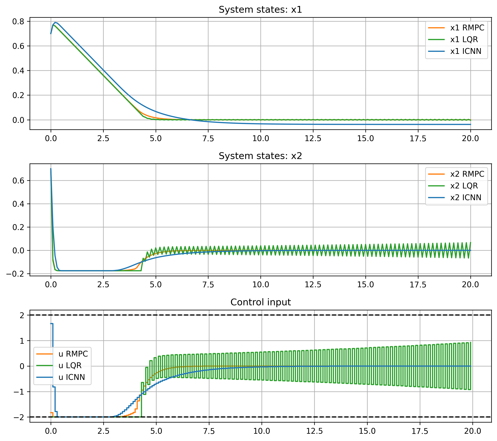
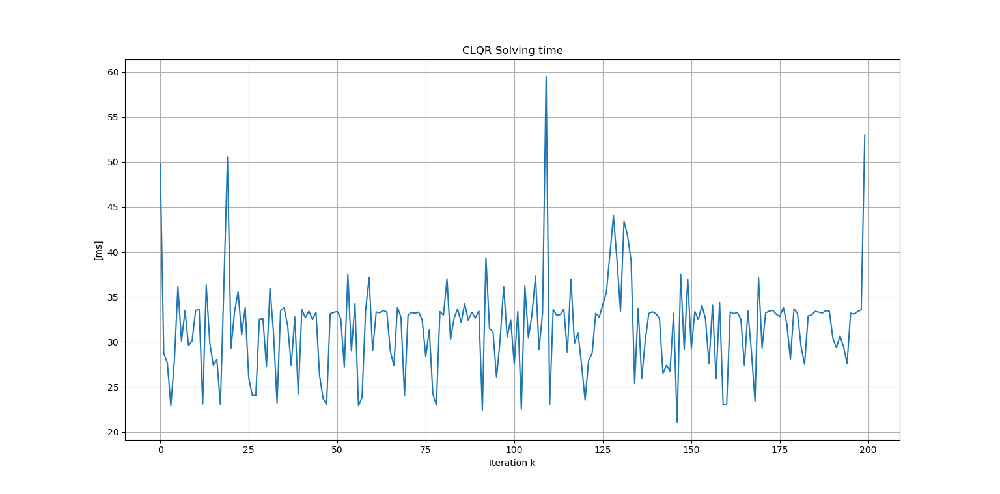
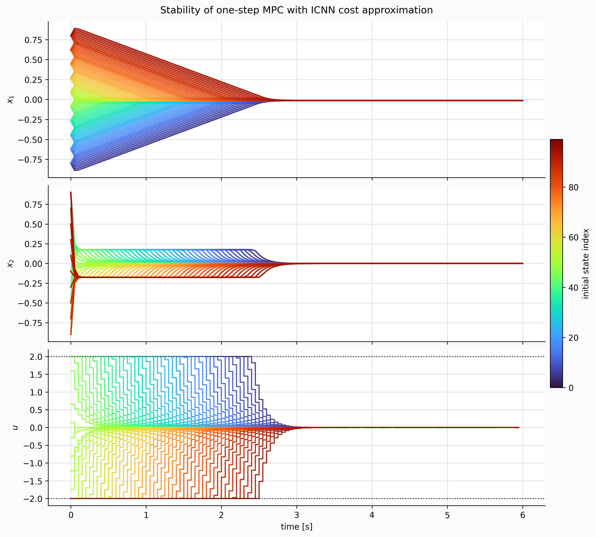

# Robust Constrained MPC Using LMIs

This repository contains LMI-based robust Model Predictive Control material developed for an IMT Honors Program project on stability analysis, robust MPC, and learning-based control approximations.

The project was developed as part of the IMT honors program over the December-April period and later cleaned into this standalone repository.

The core reference is the included paper:

- `Robust_Constrained_MPC_using_LMI.pdf`: Kothare, Balakrishnan, and Morari, "Robust Constrained Model Predictive Control using Linear Matrix Inequalities", Automatica, 1996.

The examples study constrained linear systems with polytopic uncertainty, compute stabilizing feedback gains through Linear Matrix Inequalities, and compare robust constrained MPC/CLQR behavior against nominal LQR and neural approximations. The Python experiments connect this LMI-MPC material to ICNN value-function and Lyapunov-style approximations for reducing MPC online computation.

## Research Motivation

The research topic concerns neural approximations, especially Input Convex
Neural Networks (ICNNs), in robust and nonlinear Model Predictive Control. MPC
is a powerful framework for constrained control, but its online optimization can
be computationally demanding in robust, nonlinear, or long-horizon settings. The
project therefore studies whether neural approximations can reduce online
computation while preserving useful stability structure.

The first part of the work focuses on Robust MPC through Linear Matrix
Inequalities, using the Kothare-Balakrishnan-Morari formulation for constrained
systems with polytopic uncertainty. A motivating example is motor position
control with uncertainty associated with a varying friction parameter: nominal
LQR can be fast but fragile under uncertainty, whereas RMPC provides more robust
closed-loop behavior at a higher computational cost.

The second part investigates ICNNs as approximators of quantities arising in
MPC, such as value functions, terminal costs, or optimization bounds. ICNNs are
well suited to this role because their architecture can enforce convexity with
respect to selected inputs through non-negative hidden-to-hidden weights and
convex non-decreasing activations. In this setting, the neural approximation is
not used only as a black-box controller: it is studied as a way to approximate a
cost-to-go or Control Lyapunov Function while keeping a connection with
stability-oriented MPC design.

## Control Formulations

The robust MPC examples consider uncertain linear dynamics of the form

```math
x(k+1) = A(k)x(k) + Bu(k),
\qquad
A(k) \in \mathrm{Co}\{A_1,\ldots,A_{N_v}\},
```

with quadratic stage cost and hard constraints on states and inputs. Following
the LMI formulation of Kothare, Balakrishnan, and Morari, the robust feedback
law is written as

```math
u(k) = Kx(k), \qquad K = YQ^{-1},
\qquad P = \gamma Q^{-1}, \qquad Q = Q^\top \succ 0.
```

where the decision variables `Q`, `Y`, and the performance bound `gamma` are
chosen so that a common quadratic Lyapunov certificate decreases for every
uncertainty vertex. In simplified form, the synthesis minimizes an upper bound
on the infinite-horizon cost,

```math
\min_{Q,Y,\gamma} \ \gamma
\quad \text{s.t. robust LMI conditions hold for all vertices } i,
```

together with LMI constraints enforcing admissible state and input bounds.

The LMI-based robust design is illustrated by the comparison with nominal LQR
and the ICNN approximation. In the motor-position example, the nominal LQR is
computationally light but less robust to the varying friction parameter, whereas
the LMI/RMPC controller explicitly accounts for uncertainty:



The corresponding computational-time profile highlights the cost of repeatedly
solving the robust optimization problem online:



The one-step-ahead MPC experiment replaces a long online horizon with a short
optimization plus a learned terminal value approximation. At each state `x_k`,
the controller solves a one-step problem of the form

```math
\min_{u_k} \ x_k^\top Q_c x_k + u_k^\top R u_k
          + \hat V_\theta(x_{k+1})
\quad \text{s.t.} \quad x_{k+1}=Ax_k+Bu_k,
```

subject to the input and state constraints used by the nominal MPC problem. The
ICNN tail-cost model `\hat V_\theta` is trained to approximate the downstream MPC
value function, so the online optimization keeps a one-step prediction while
retaining information about the longer-horizon cost-to-go.

The stability-oriented part of the project studies certified value-function
bounds. If the true optimal value function `V^\star` is enclosed by lower and
upper approximations,

```math
V_{\mathrm{down}}(x,p) \le V^\star(x,p) \le V_{\mathrm{up}}(x,p),
```

then a conservative sufficient decrease condition can be imposed as

```math
V_{\mathrm{up}}(x^+,p) - V_{\mathrm{down}}(x,p) \le 0.
```

This condition is conservative, but it expresses the intended Lyapunov logic:
the true value function decreases along the closed-loop trajectory despite the
approximation error introduced by the neural model.

Equivalently, when a terminal cost acts as a Control Lyapunov Function, the
nominal closed-loop stability objective can be written through the decrease
condition

```math
V(x_{k+1}) - V(x_k) \le -\ell(x_k,u_k),
```

where `\ell(x_k,u_k)` is the stage cost. The one-step-ahead formulation uses the
learned cost-to-go to retain this long-horizon information while reducing online
optimization effort.

## Repository Structure

- `fig/`: selected MATLAB-generated figures for the constrained LQR/RMPC examples, including closed-loop responses and pole trajectories.
- `matlab/`: MATLAB/YALMIP implementations of LMI-based constrained control examples.
- `python/`: Python experiments for robust CLQR simulations, ICNN/MLP approximation, one-step MPC with learned tail cost, and Lyapunov-style ICNN controllers.
- `python/dataset/`: CSV datasets and tabular experiment summaries used by the Python scripts.
- `python/icnn_lyapunov/`: more structured PyTorch code for learning value/Lyapunov approximations and testing closed-loop behavior.
- `python/figure/`: plots used to document Python experiments, including CLQR/ICNN comparisons, model-selection diagnostics, computational-time summaries, and one-step MPC results.
- `python/nn_model/`: trained PyTorch checkpoints used by the neural approximation experiments.
- `Robust_Constrained_MPC_using_LMI.pdf`: included reference paper for the LMI robust MPC formulation.

## MATLAB Usage

Run the MATLAB examples from the repository root:

```matlab
run('matlab/main.m')
run('matlab/antenna_example.m')
run('matlab/antenna_traj_example.m')
```

The scripts add their own folder to the MATLAB path so helper functions such as `lmi_clqr.m` and `lmi_mpc.m` can be found when launched from the root.

MATLAB dependencies:

- MATLAB with Control System Toolbox functions such as `dlqr`.
- YALMIP.
- A semidefinite programming solver supported by YALMIP, such as SeDuMi, SDPT3, or MOSEK.

## Python Usage

Create and activate a Python environment, then install the main scientific stack:

```powershell
python -m venv .venv
.\.venv\Scripts\Activate.ps1
pip install numpy scipy pandas matplotlib torch cvxpy
```

Examples can be launched from the repository root:

```powershell
python .\python\sim_clqr_lqr.py
python .\python\mpc_icnn_onestep.py
python .\python\icnn_lyapunov\simulate_closed_loop.py --checkpoint icnn_lyapunov\gamma_icnn.pth --nsim 30 --u-max 2.0
```

The scripts use paths relative to their own source folder, so datasets,
checkpoints, and generated figures remain under `python/dataset/`,
`python/nn_model/`, and `python/figure/`, respectively.

## Reproducing Examples

1. Start with the MATLAB LMI examples in `matlab/` to reproduce robust constrained feedback gains and closed-loop comparisons.
2. Use `python/sim_clqr_lqr.py` to compare LQR, robust CLQR/RMPC, and the stored ICNN approximation.
3. Use `python/mpc_icnn_onestep.py` to run the one-step MPC tail-cost approximation experiment. Existing datasets and checkpoints are reused unless the rebuild flags in the script are changed.
4. Use `python/icnn_lyapunov/README.md` for the more detailed ICNN Lyapunov/value-actor workflow.

## Selected Results

The stability-oriented one-step MPC experiment uses the learned ICNN terminal
cost as a cost-to-go approximation inside a prediction horizon of length one.
The resulting online problem can be read as

```math
\begin{aligned}
\min_{u_k,\,x_{k+1}} \quad
& \ell(x_k,u_k) + \hat V_\theta(x_{k+1}) \\
\text{s.t.} \quad
& x_{k+1} = f(x_k,u_k), \\
& x_k \in \mathcal X,\quad u_k \in \mathcal U,
\end{aligned}
```

where `\hat V_\theta` is intended to approximate the remaining long-horizon
cost. Following the presentation logic, if this terminal approximation behaves
as a Control Lyapunov Function, the decrease condition

```math
\hat V_\theta(x_{k+1}) - \hat V_\theta(x_k) \le -\ell(x_k,u_k)
```

provides the stability mechanism while reducing the online prediction horizon to
`N = 1`. The multi-initial-condition trajectories below summarize the resulting
one-step-ahead behavior:



## Stored Artifacts

The repository intentionally keeps small CSV datasets, trained `.pth` checkpoints, and generated figures that are needed to reproduce or inspect the existing examples without regenerating every optimization result from scratch. No tracked file is larger than 50 MB at the time of cleanup.

Future large experiment outputs should be kept out of Git and stored externally or regenerated from scripts.

See `NOTES.md` for dependency limitations and verification details. See
`DEVELOPMENT_TIMELINE.md` for the documented December-April development
chronology.

## Project Context

This project supports the IMT Honors Program work on robust constrained MPC, LMI stability conditions, and learning-based approximations. The LMI-MPC examples provide the robust-control foundation; the Python/ICNN material explores how convex neural approximations can reduce online computation while preserving value-function or Lyapunov-style structure where possible.
